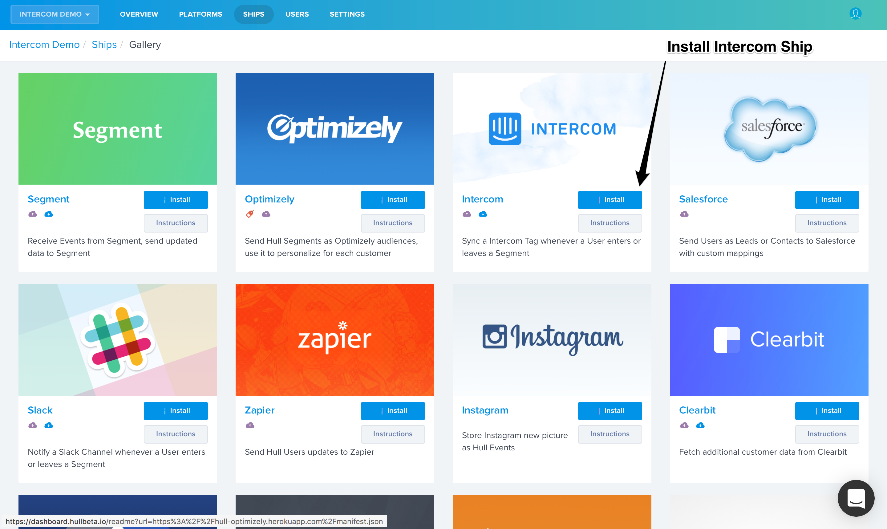
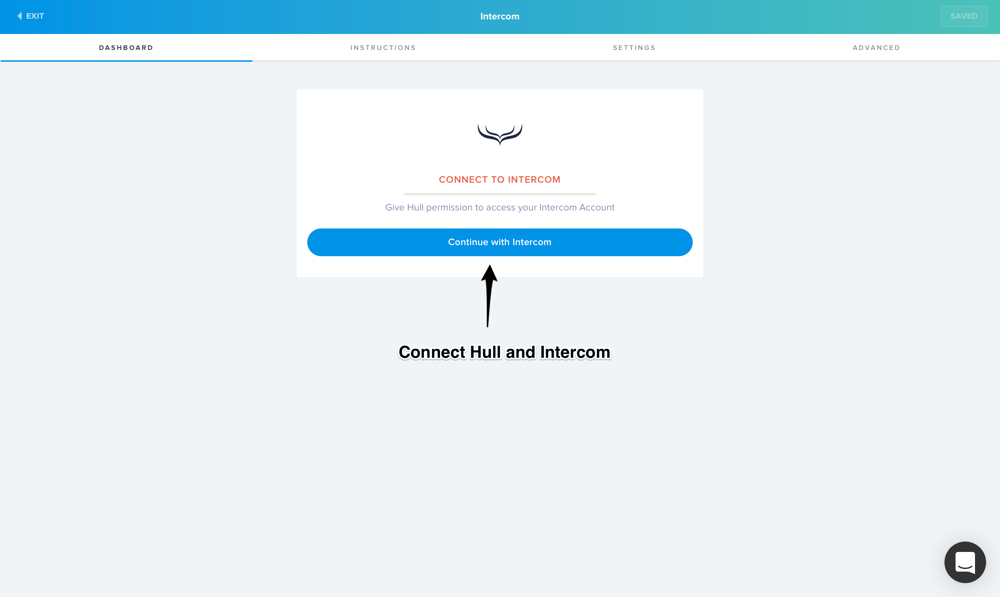
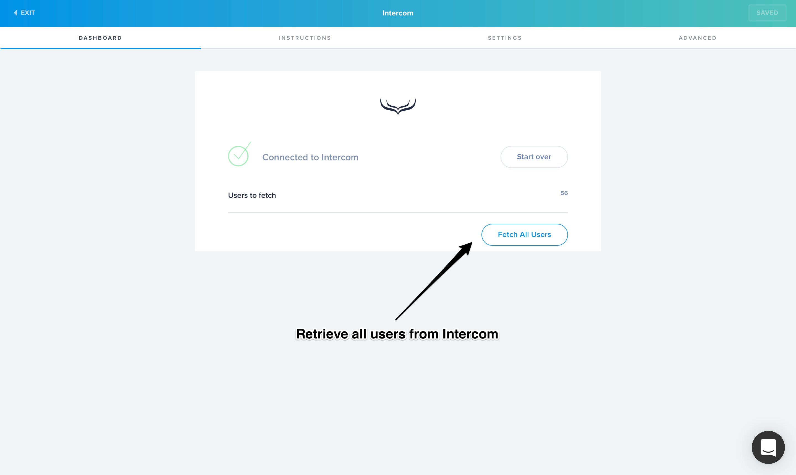
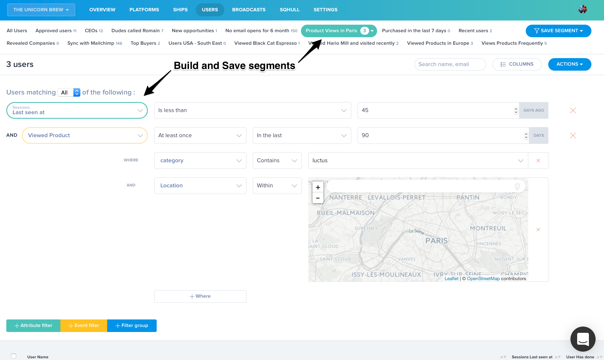
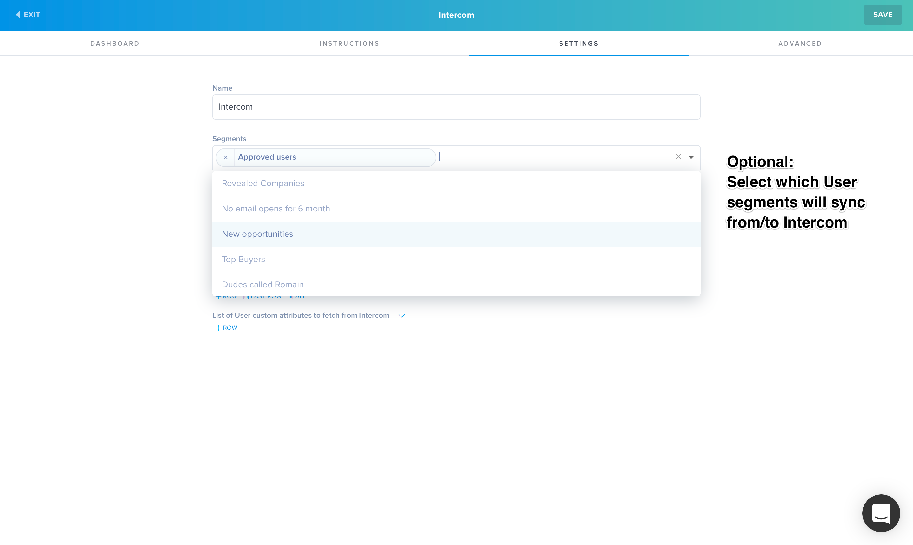
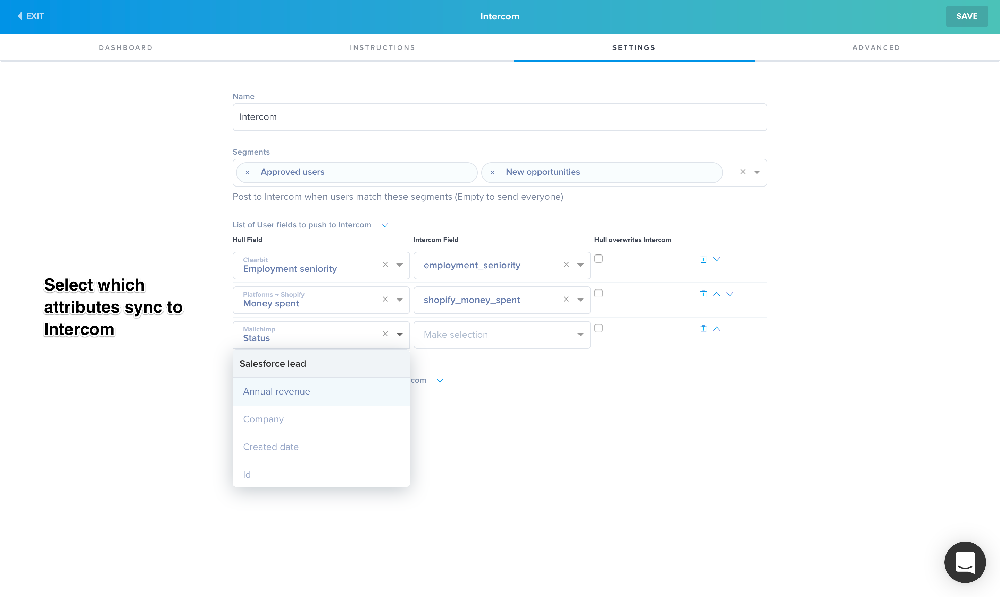
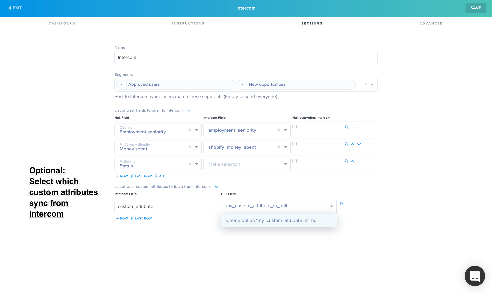

# Hull + Intercom

[Visit Intercom website](http://intercom.com)

__The Intercom Ship allows you to sync users in Hull with Intercom__

#### Install:

- Install the Ship

- Click the "Connect to Intercom" button on the Dashboard page & Authorize Hull to access your account.

- Optional: Click "Fetch All" if you want to import all Intercom users into Hull

#### Usage

- Create and save some Segments in Hull

- Select which users are synchronized to Intercom by specifying the segments they need to belong to.

- Intercom Users will be tagged with every Hull segment they belong to.

- Select Hull attributes to send to Intercom

- Select Intercom custom attributes to retrieve (Standard attributes are fetched automatically)

